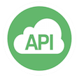

  

#BGL API

The BGL API is a set of RESTful Web Services using [OAuth 2.0 protocol](http://oauth.net/2/) as the security mechanism.
The API provides access to BGL users' Data to client applications with the users' consent.

The objective of this document is to provide information on the BGL API set-up and the resources required to request information through the BGL API to developers.

**Version**
* 1.0.3 - See [Release Log](https://github.com/BGLCorp/API/releases)

**Environment(s)**
* Production:
https://api.bgl360.com.au
* Pre-production/Sandbox:
https://api-staging.bgl360.com.au

**Contact Us/Support:**
*  [BGL API Team](mailto:wtan@bglcorp.com.au)

**Feedback/Issue in Github**
* https://github.com/BGLCorp/API

 
---
###### BGL Corporate Solutions Pty Ltd
###### Suite 2, 606-608 Hawthorn Road, Brighton East, Victoria, 3187, Australia
###### Phone: 1300 654 401 / +61 (0)3 9530 6077 ACN: 054 355 243

