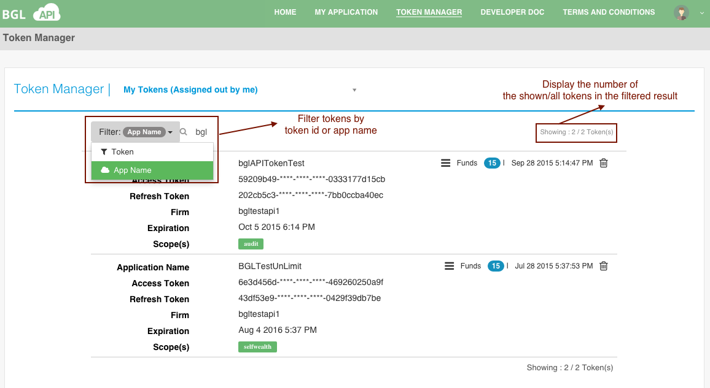
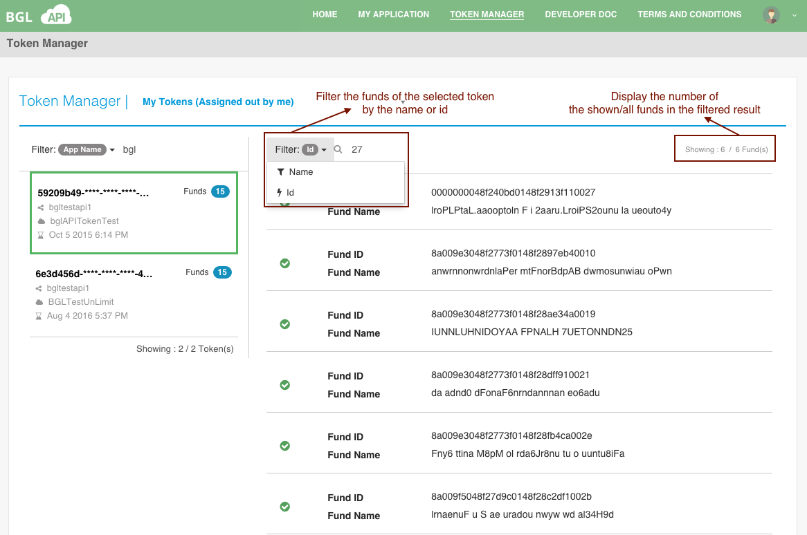

# Filter Function

In Token manager, there are two filter functions: token filter and fund filter.

You can search the token by the following two input:
    - token id
    - owner/application name

Also, you can find the accessable funds for the selected token with the following input:
    - fund id
    - fund name

