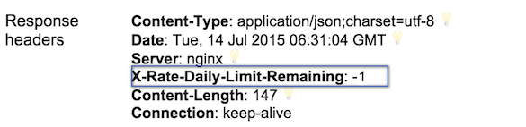

# API Rate Limits

In order to manage the high volume of requests, the BGL API will limit the number of requests a client application can make to the BGL API based on two aspects, as per explained below.

#### 1. X-Rate Daily Limit


This value indicates the number of requests a client can make on a given day. Currently this is set to unlimited in the staging envoirnment (https://api-staging.bgl360.com.au).

The response header "**X-Rate-Daily-Limit-Remaining**" indicates the remaining number of requests available.  For every valid request made, this indicator will reduce its count by one. Zero means the available daily limit has been reached. -1 indicates that unlimited requests can be made.



If the daily limit has been exceeded, the following error will display with status - **429 Too Many Requests**.

```javascript

{
    "message": "Too Many Requests",
    "errors": [
        "You had too many requests today, the rate limit ceiling per day is 1000"
    ],
    "status": 429
}

```

Please note that any request returned with http code(status) 401 or 429 will not reduce the daily limit threshold.

#### 2. X-Rate Limit


This value indicates the number of requests that can be made within a given time frame. Currently this is set to **100 per 10 minutes** period in the staging envoirnment (https://api-staging.bgl360.com.au).

If the number of requests a client makes exceeds the specified X limit, the BGL API will return an error response as follows, with status - **429 Too Many Requests**.


```javascript

{
    "message": "Too Many Requests",
    "errors": [
        "You had too many requests in last 10 mins, the rate limit ceiling for every 10 mins is 100"
    ],
    "status": 429
}

```

