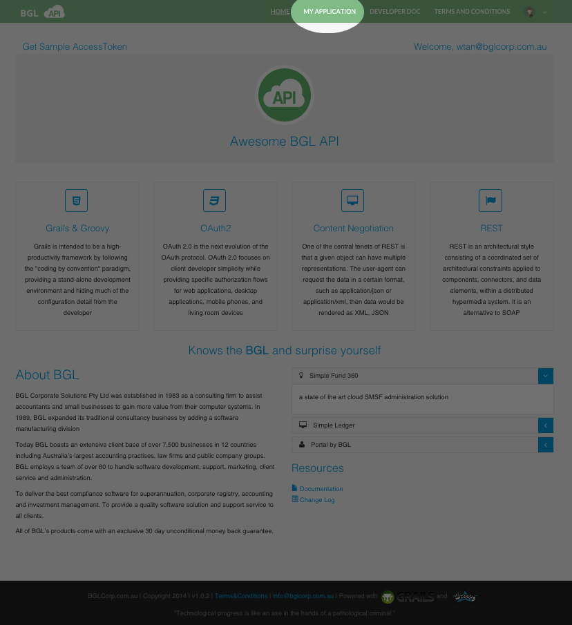

# My Application

This section explains how an Organisation or a User can register to receive access to the BGL 360 API.

Before you can use My Application, you need a Simple Fund 360 username and password.

<OL type=0>
<LI>Go to the API website and select **MY APPLICATION** from the main menu.
  

</LI>
<LI>Input the Simple Fund 360 Username and Password.</LI>
</OL>

