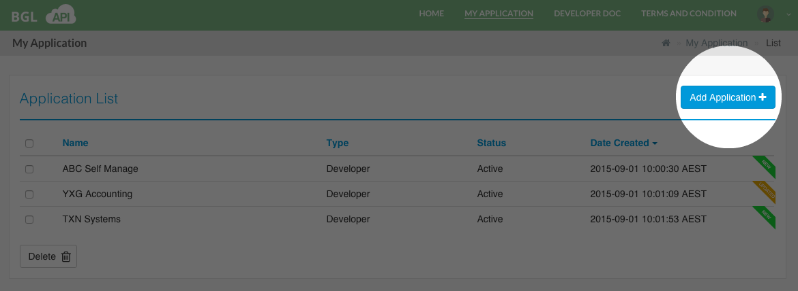
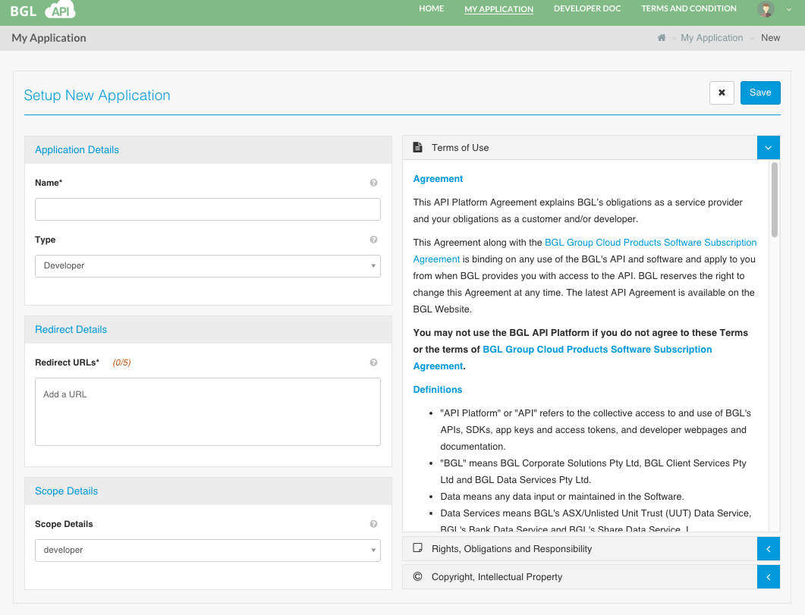
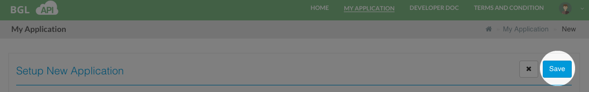
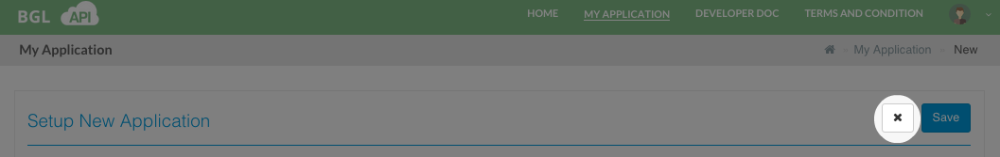

# Add Application

Select **Add Application** in the [Application List](list_application.md) page as displayed below.

This will redirect the user to the '**Setup New Application**' Page as shown below.

Following are the details that needs to be added to create an API Application/Client.

<table>
    <tr>
        <th>Field</th>
        <th>Description</th>
        <th>Required</th>
    </tr>
    <tr>
        <td id="applicationName">Name</td>
        <td>The API Application/Client Name.</td>
        <td>Yes</td>
    </tr>
    <tr>
        <td id="applicationType">Type</td>
        <td>The API Application/Client Type. Please see Please see [API Application Type(s)](../application_types/README.md) for more details.  Currently the supported type is 'Developer'.</td>
        <td>Yes</td>
    </tr>
    <tr>
        <td id="applicationRedirectURL">Redirect URLs</td>
        <td>The URL that will be used to redirect after Authorization.    The first URL entered in the list will be used as the Default Redirect URL (which will be displayed in a different colour in the list).    However, if you wish to use any other Redirect URL in the list that you have added, then you will need to provide this in the [Request for Authorization Code](../getting_started/request_for_an_authorization_code.md).    Atleast one Redirect URL should be added to this field.  You can add upto 5 Redicrect URLs.  Only valid URLs can be entered into this field.</td>
        <td>Yes</td>
    </tr>
    <tr>
        <td id="applicationScope">Scope</td>
        <td>The API Application/Client Scope. Please see [API Scopes](../api_scopes/README.md) for more details.  Currently the supported type is 'Developer'.
        </td>
        <td>Yes</td>
    </tr>
</table>

Once you have entered the necessary information, ensure you have read and agreed to the the Terms and Conditions.

Select '**Save**' as displayed above to add the API Application/client. The Application will be added and you will be redirected to the [Edit Application Details](edit_application.md) page.

The **Close** button, as displayed above will discard any information you have added and take the user to the Application List page.

####Success Messages

<table>
    <tr>
        <th>Message</th>
        <th>Description</th>
    </tr>
    <tr>
        <td>Saved &lt;Application Name/Client&gt; Successfully</td>
        <td>If adding the Application/Client was successful.</td>
    </tr>
</table>

####Error Messages

<table>
    <tr>
        <th>Message</th>
        <th>Description</th>
    </tr>
    <tr>
        <td>Application Name cannot be left blank</td>
        <td>If you have not entered a Name for the Application/Client.</td>
    </tr>
    <tr>
        <td>At least 1 Redirect URL should exist</td>
        <td>If you have not entered a Redirect URL.</td>
    </tr>
</table>
