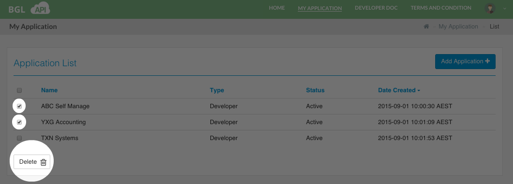

# Delete Application(s)

In order to delete an Application/Client the user should tick on the check boxes of the Applications/Client he/she would want to delete and then select the 'Delete' button, as shown below.

This will delete the selected Application(s)/Client(s).  If the deletion is succesful the Application List will be refreshed to display the currently available Application(s)/Client(s).

####Success Messages

<table>
    <tr>
        <th>Message</th>
        <th>Description</th>
    </tr>
    <tr>
        <td>Removed &lt;Application Name/Client&gt; Successfully</td>
        <td>If deleting the Application/Client was successful.</td>
    </tr>
</table>
