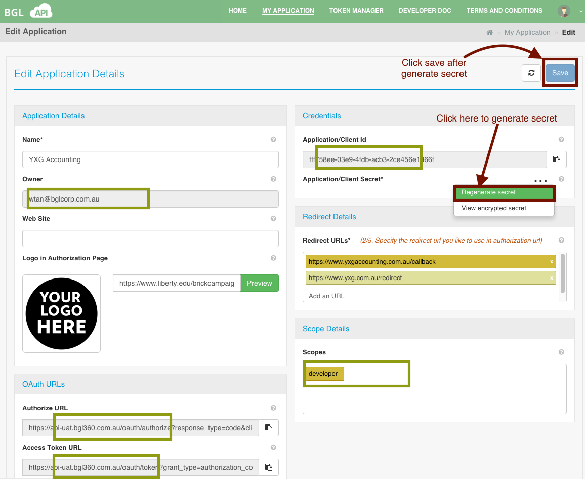
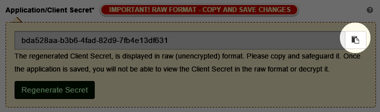

# Edit Application

The Edit Application Details page as displayed below, allows you to make changes to the application information you have previously entered.

<table>
    <tr>
        <th>Field</th>
        <th>Description</th>
        <th>Required</th>
    </tr>
    <tr>
        <td><a name="applicationName">Name</a></td>
        <td>The API Application/Client Name.</td>
        <td>Yes</td>
    </tr>
    <tr>
        <td><a name="applicationOwner">Owner</a></td>
        <td>Username who owns/created the application.  This is a read-only field.</td>
        <td>Yes</td>
    </tr>
    <tr>
        <td><a name="applicationWebsite">Web Site</a></td>
        <td>The Web Site URL of the Organization using this Application/Client.  The entered URL should be a valid, well formed URL.</td>
        <td>No</td>
    </tr>
    <tr>
        <td><a name="applicationLogo">Logo in Authorization Page</a></td>
        <td>The Logo that will be displayed in the Authorization Page.  Enter a valid url that points to the Organization Logo.    Select '**Preview**' to preview the entered logo URL as displayed below.
          
        
        </td>
        <td>No</td>
    </tr>
    <tr>
        <td><a name="applicationAuthURL">Authorize URL</a></td>
        <td>This is an auto generated URL that could be used to obtain the Authorization Code. This is a read-only field.  Select the copy button next to this URL to copy this URL to the clip board, as shown below.
          
        
          Please see [Request for an Authorization Code](../getting_started/request_for_an_authorization_code.md) for more details.  </td>
        <td>No</td>
    </tr>
    <tr>
        <td><a name="applicationAccessTokenURL">Access Token URL</a></td>
        <td>This is an auto generated URL that could be used to obtain the Access Token Code.  This is a read-only field. Select the copy button next to this URL to copy this URL to the clip board, as shown below.    
        
          Please see [Obtaining Access Token](../getting_started/obtaining_request_token.md) for more details.  Replace '**%3CAUTHCODE%3E**' with the actual Authorization code before using this URL.  </td>
        <td>No</td>
    </tr>
    <tr>
        <td><a name="applicationClientId">Application/Client Id</a></td>
        <td>This is a read-only field, displaying the unique Client Id. Select the copy button next to this, to copy this URL to the clip board, as shown below.    
        </td>
        <td>Yes</td>
    </tr>
    <tr>
        <td><a name="applicationClientSecret">Application/Client Secret</a></td>
        <td>This is a read-only field.  When the Application/Client is loaded into the Edit Application screen, the Client Secret is displayed in the encrypted format.
          Select **Regenerate Secret** as shown below, to regenerate the Application/Client Secret.
          
        
          
        Once the Application/Client Secret is regenerated it will be displayed in '_Raw Format_'.  **This should be copied and safe guarded**. When the Application/Client Secret is regenerated, the user will be displayed a copy button next to the generated secret as shown below.  
        
          
        You could select the copy button to copy the Application/Client Secret to the clip board.
          Once the Application is saved, this secret will be encrypted. BGL does not store the _Raw Format_ and there is no way of retrieving the _Raw Format_.  </td>
        <td>Yes</td>
    </tr>
    <tr>
        <td><a name="applicationRedirectURL">Redirect URLs</a></td>
        <td>The URL that will be used to redirect after Authorization.    The first URL entered in the list will be taken as the default redirect url (which will be displayed in a different colour in the list).    However, if you wish to use any other call back url in the list that you have added, then you will need to provide this in the [Request for Authorization Code](../getting_started/request_for_an_authorization_code.md).    Atleast one Redicrect URL should be added to this field.  You can add upto 5 Redicrect URLs.  Only valid URLs can be entered into this field.</td>
        <td>Yes</td>
    </tr>
    <tr>
        <td><a name="applicationScope">Scope</a></td>
        <td>The API Application/Client Scope. Please see [API Scopes](../api_scopes/README.md) for more details.  Currently the supported type is 'Developer'.</td>
        <td>Yes</td>
    </tr>
</table>

Select '**Save**' as shown below, to update the API Application/client. The Application will be updated and you will be redirected to the  [Application List](list_application.md) page.

####Success Messages

<table>
    <tr>
        <th>Message</th>
        <th>Description</th>
    </tr>
    <tr>
        <td>Updated &lt;Application Name/Client&gt; Successfully</td>
        <td>If updating the Application/Client was successful.</td>
    </tr>
</table>

####Error Messages

<table>
    <tr>
        <th>Message</th>
        <th>Description</th>
    </tr>
    <tr>
        <td>Application Name cannot be left blank</td>
        <td>If you have not entered a Name for the Application/Client.</td>
    </tr>
    <tr>
        <td>Application Web Site should have a valid URL or should be left blank</td>
        <td>If you have entered an invalid URL for the Web Site.</td>
    </tr>
    <tr>
        <td>ApplicationApplication Logo should have a valid URL or should be left blank</td>
        <td>If you have entered an invalid URL for the Application Logo URL.</td>
    </tr>
    <tr>
        <td>At least 1 Redirect URL should exist</td>
        <td>If you have not entered a Redirect URL.</td>
    </tr>
</table>
