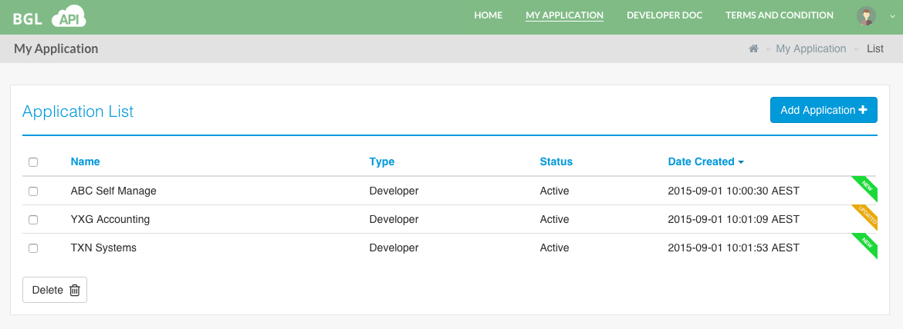

# Application List

Select **MY APPLICATION** from the main menu.  This will take the user to the **Application List** page, as shown below.

The **Application List** displays the applications that are currently available under the logged in user's account.  The details that are displayed are as follows;

<table>
    <tr>
        <th>Column Name</th>
        <th>Description</th>
        <th>Sortable</th>
    </tr>
    <tr>
        <td>Name</td>
        <td>The Name of the API Application or Client.</td>
        <td>Yes</td>
    </tr>
    <tr>
        <td>Type</td>
        <td>The API Application Type.  Please see [API Application Type(s)](../application_types/README.md) for more details.</td>
        <td>Yes</td>
    </tr>
    <tr>
        <td>Status</td>
        <td>The current status of the Appliction/Client.  Please see [API Application Status](application_status.md) for more details.</td>
        <td>Yes</td>
    </tr>
    <tr>
        <td>Date Created</td>
        <td>Displays the date when the Application/Client was created.</td>
        <td>Yes (Default - the listing will be sorted in Descending order).</td>
    </tr>
</table>

For the convenience of the user, newly created Applications/Clients within the last 5 minutes will be labelled as **New** and the Applictions/Clients that are updated within the last 5 minutes will be labelled as **Update**.

**Note :** Only  [Active](application_status.md#activeStatus) and [Inactive](application_status.md#inactiveStatus) Application(s)/Client(s) will be displayed.

Each of the application, displayed in the listing are clickable, which will take the User to the [Edit Application Details](edit_application.md) Page.
