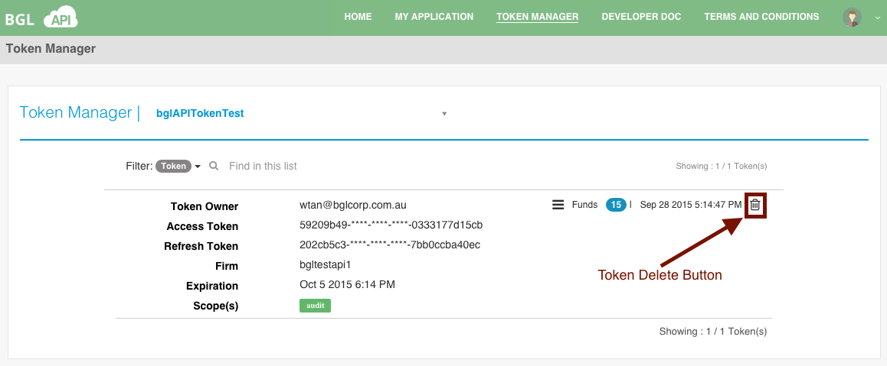

# Delete Token

To delete the token:
* Navigate to the [View Token](view_token.md) page.
* Select an Application.
* Select the **Delete** button, as shown below.

This will delete the selected token.  If the deletion is succesful, the Token Manager will refresh to display the currently available tokens.

####Success Messages

<table>
    <tr>
        <th>Message</th>
        <th>Description</th>
    </tr>
    <tr>
        <td>&lt;Token&gt; was deleted successfully</td>
        <td>If deletion of the Token was successful.</td>
    </tr>
</table>
