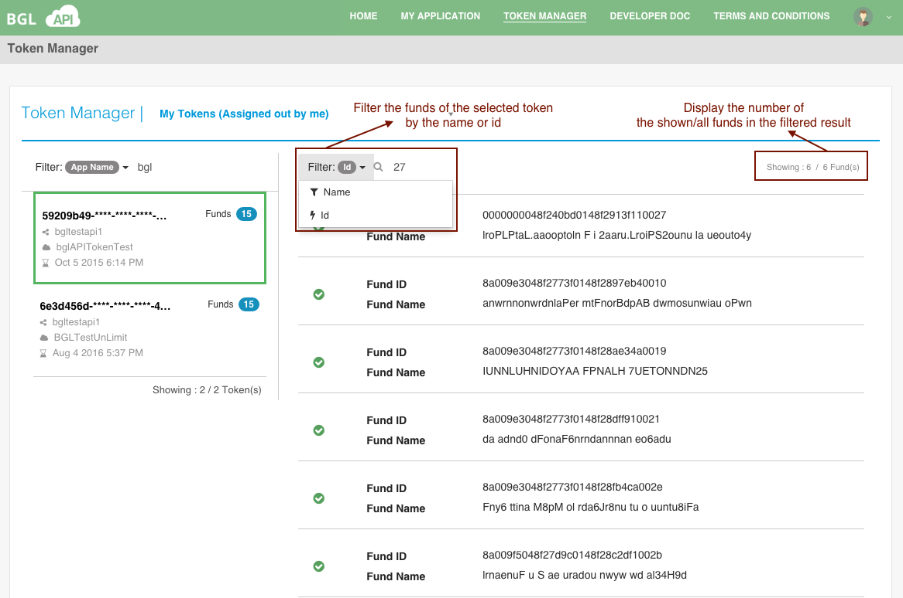

# Fund Filter

The fund filter displays as follows:

Also, you can find the accessable funds for the selected token with the following input:

<table>
    <tr>
        <th>Item</th>
        <th>Description</th>

    </tr>
    <tr>
        <td>Name</td>
        <td>The fund name for a given token</td>

    </tr>
    <tr>
        <td>Id</td>
        <td>The fund id for a given token</td>

    </tr>

</table>
