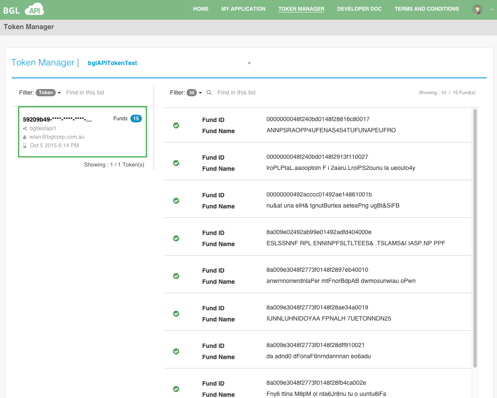
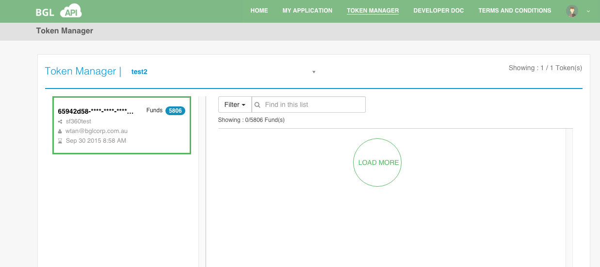

# Fund List

When click the token detail view, it would list all the funds related to the selected token.

 In the page, you can search the token by input the part or entire of token characters, or user name of the owner into the filter filed on the left side. And also you can find the fund response to the selected token by fund id or fund name using the filter field located at the right side.
 

Click the **Load More** button to load more funds.

Click the **Arrow** located in the left boundary of the token box to view the token details.

