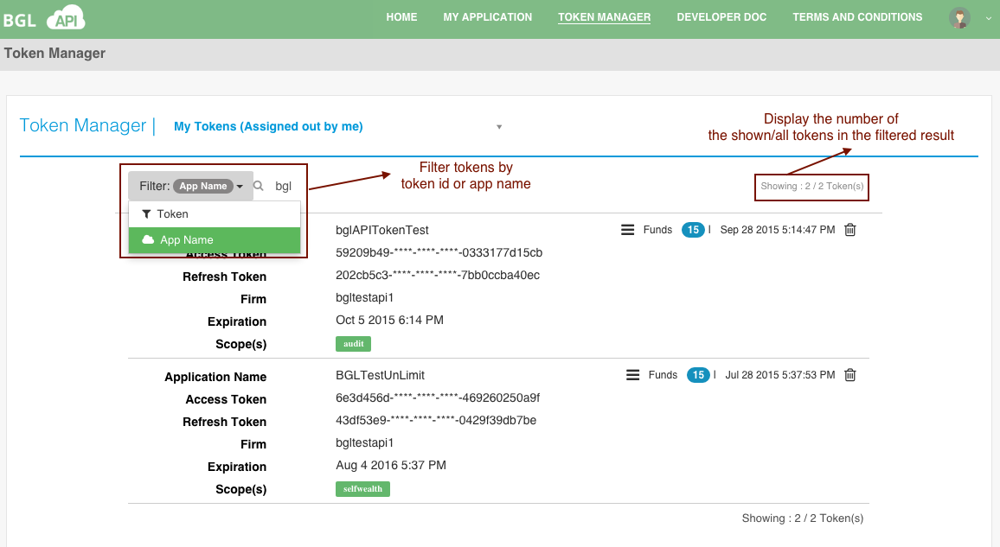

# Token Filter

The token filter displays as follows:

You can search the token by the following two input:

<table>
    <tr>
        <th>Item</th>
        <th>Description</th>

    </tr>
    <tr>
        <td>Token</td>
        <td>The token id for the searching token</td>

    </tr>
    <tr>
        <td>App Name</td>
        <td>The application name for the searching token</td>

    </tr>
    <tr>
        <td>Owner</td>
        <td>The owner of the searching token</td>

    </tr>

</table>
