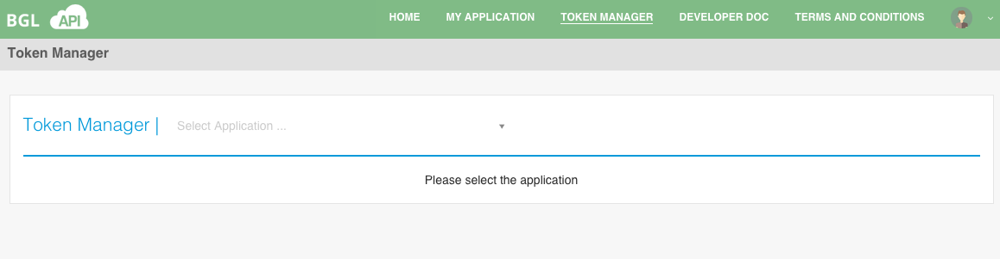
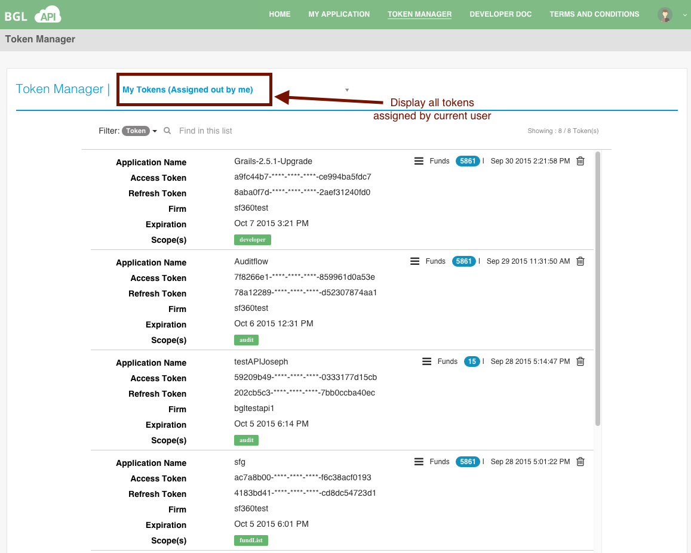
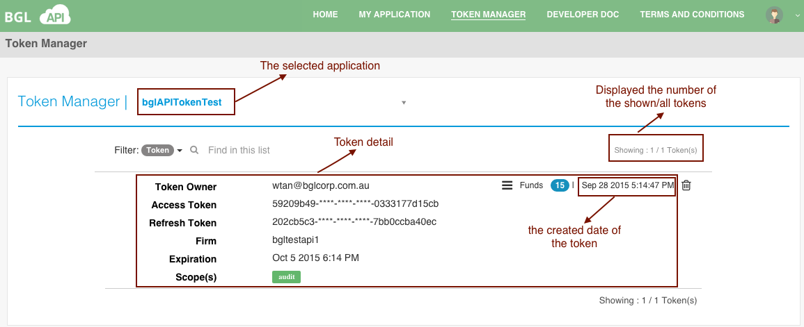

# View Token
Select **Token Manager** from the main menu.  This will take the user to the **Token Manager** page, as shown below.

Please select an application when you are at the **Token Manager** page.  The details that are displayed are as follows;

The **Token Detail** would be shown on the screen after you select the specific application if this application has the validate access token. The details of all tokens assigned by current user that are displayed are as follows;

You can search the token by token and owner.

The items in the detail are as follows.

<table>
    <tr>
        <th>Item</th>
        <th>Description</th>

    </tr>
    <tr>
        <td>Token Owner</td>
        <td>The login user</td>

    </tr>
    <tr>
        <td>Access Token</td>
        <td>The access token that is mandatory for requesting data from BGL API. This value must be kept secure.</td>

    </tr>
    <tr>
        <td>refresh_token</td>
        <td>A token that may be used to obtain new access tokens. Refresh tokens are valid until the user revokes access.</td>

    </tr>
    <tr>
        <td>Firm</td>
        <td></td>

    </tr>
    <tr>
        <td>Expiration</td>
        <td>The deadline of access token will be expired. Currently, all access tokens are issued with a 7-day lifespan.</td>

    </tr>
    <tr>
        <td>Scope</td>
        <td>The scope of this access token - what data can be accessed.</td>

    </tr>
    <tr>
        <td>Funds</td>
        <td>The total number of funds when the token generated</td>

    </tr>

</table>
