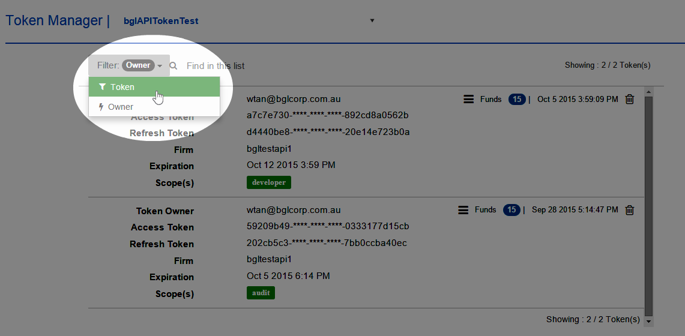
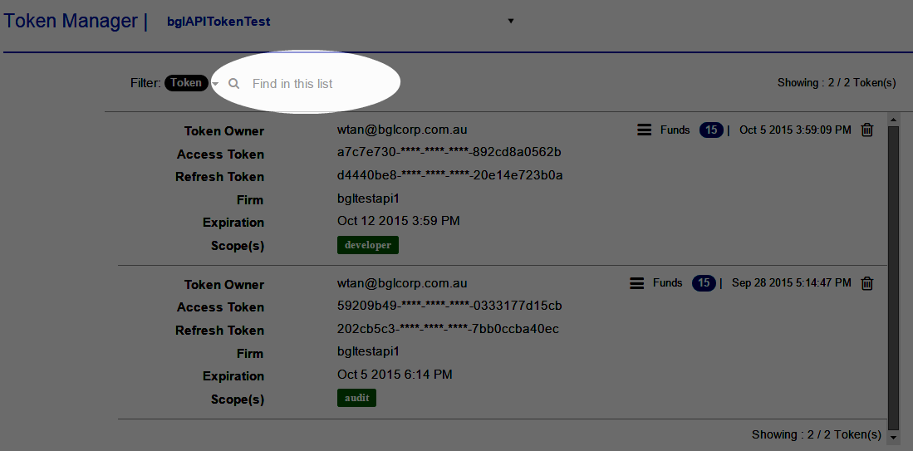
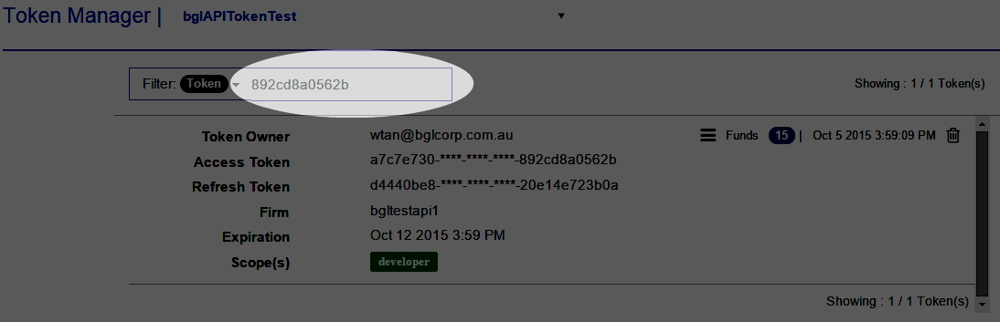

# View Application Token
Select **Token Manager** from the main menu.  This will take the user to the **Token Manager** page, as shown below.

Select an application from the drop-down list next to **Token Manager**. If the selected application has valid (not expired) access token(s), the **Token Detail** for that token will show on-screen. The details displayed are as follows:

<table>
    <tr>
        <th>Item</th>
        <th>Description</th>

    </tr>
    <tr>
        <td>Token Owner</td>
        <td>The owner of the token</td>

    </tr>
    <tr>
        <td>Firm</td>
        <td>The login used for that firm</td>

    </tr>
    <tr>
        <td>Access Token</td>
        <td>The access token that is mandatory for requesting data from the BGL API. This value must be kept secure.</td>

    </tr>
    <tr>
        <td>Refresh Token</td>
        <td>A token that may be used to obtain new access tokens. Refresh tokens are valid until the user revokes access.</td>

    </tr>

    <tr>
        <td>Expiration</td>
        <td>The date and time when the access token will expire. Currently, all access tokens are issued with a 7-day lifespan.</td>

    </tr>
    <tr>
        <td>Scope</td>
        <td>This defines what data can be accessed with the token.</td>

    </tr>
    <tr>
        <td>Funds</td>
        <td>The total number of funds to which access was provided when the token was generated</td>

    </tr>
     <tr>
        <td>Date</td>
        <td>This specifies when the token was created</td>

    </tr>

</table>

You can also use the **Filter** to sort the list of tokens.

There is also a search feature available. For example, you can use it to search for a specific access token, as shown below.

Type in the text or code you are searching for.

Only the token with that access code will then display.

