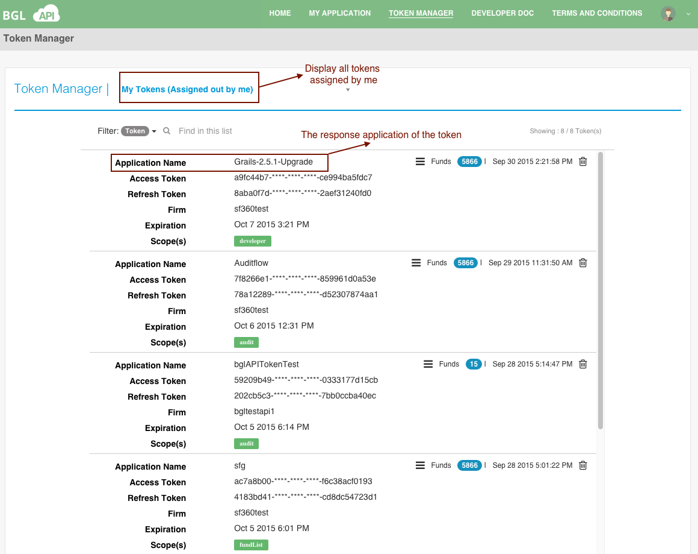

# View My Token(s)

From the **Select Application** menu, select **My Tokens**.  This will list all the tokens that are owned by the current user, as displayed in the below image.

Following are the details that each token will contain;

<table>
    <tr>
        <th>Item</th>
        <th>Description</th>

    </tr>
    <tr>
        <td>Application Name</td>
        <td>The name of the application that this token belongs to.</td>
    </tr>
    <tr>
        <td>Firm</td>
        <td>The user login firm</td>

    </tr>
    <tr>
        <td>Access Token</td>
        <td>The access token that is mandatory for requesting data from BGL API. This value must be kept secure.</td>

    </tr>
    <tr>
        <td>refresh_token</td>
        <td>A token that may be used to obtain new access tokens. Refresh tokens are valid until the user revokes access.</td>

    </tr>

    <tr>
        <td>Expiration</td>
        <td>The deadline of access token will be expired. Currently, all access tokens are issued with a 7-day lifespan.</td>

    </tr>
    <tr>
        <td>Scope</td>
        <td>The scope of this access token - what data can be accessed.</td>

    </tr>
    <tr>
        <td>Funds</td>
        <td>The total number of funds applicable for a given token</td>

    </tr>
     <tr>
        <td>Date</td>
        <td>The created date of the token</td>

    </tr>

</table>
