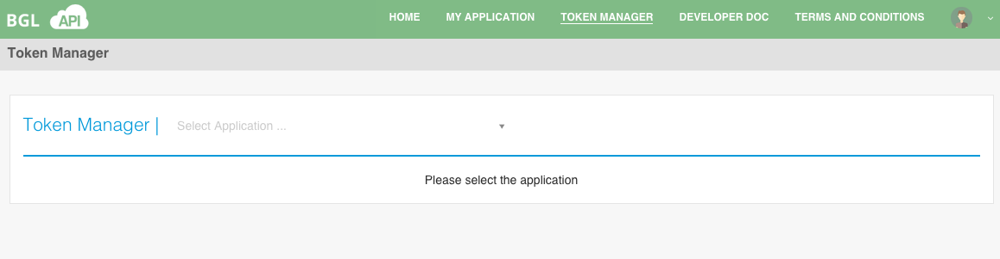

# View Token(s)

Click on **TOKEN MANAGER** from the main menu.  This will take the user to the **Token Manager** page, as shown below.

View Token(s) can be used to list tokens based on:

* Application Token(s) - Please see [View Application Token(s)](view_applcation_tokens.md)
* My Token(s) - Please see [View My Token(s)](view_my_tokens.md)
